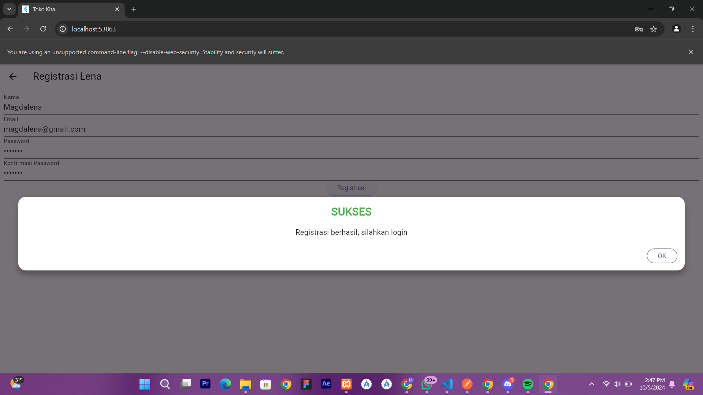
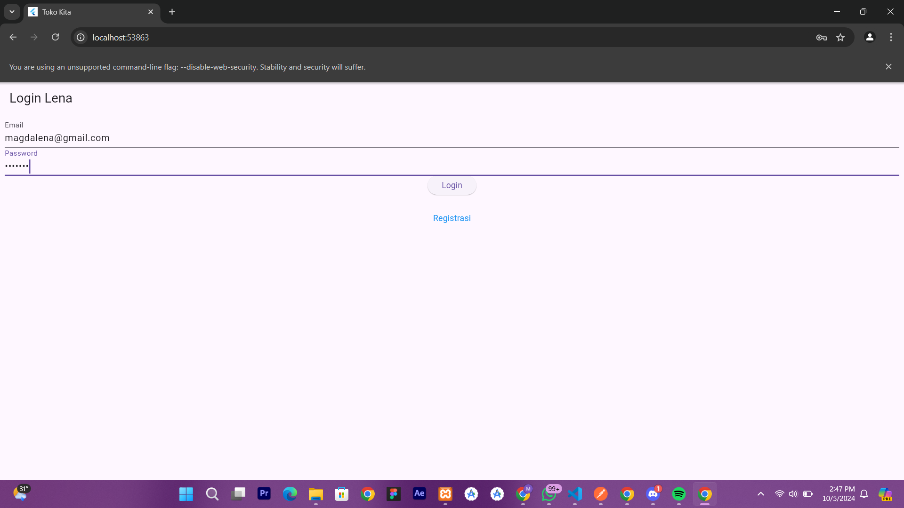
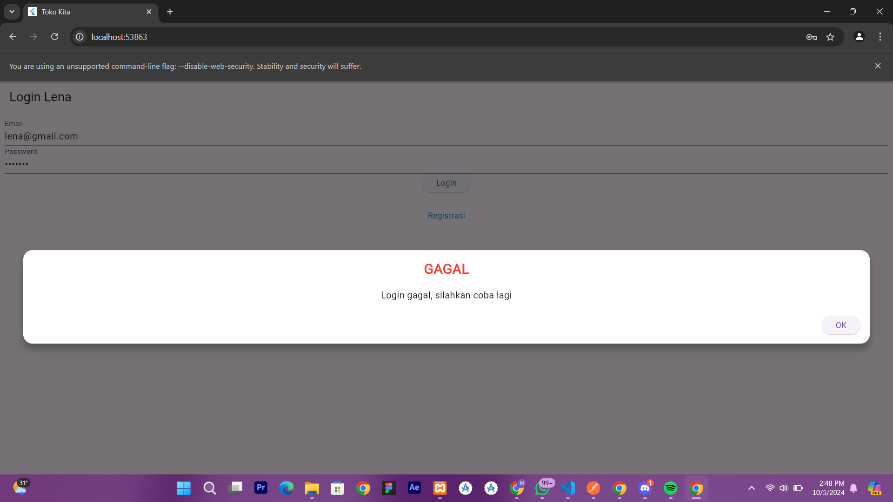
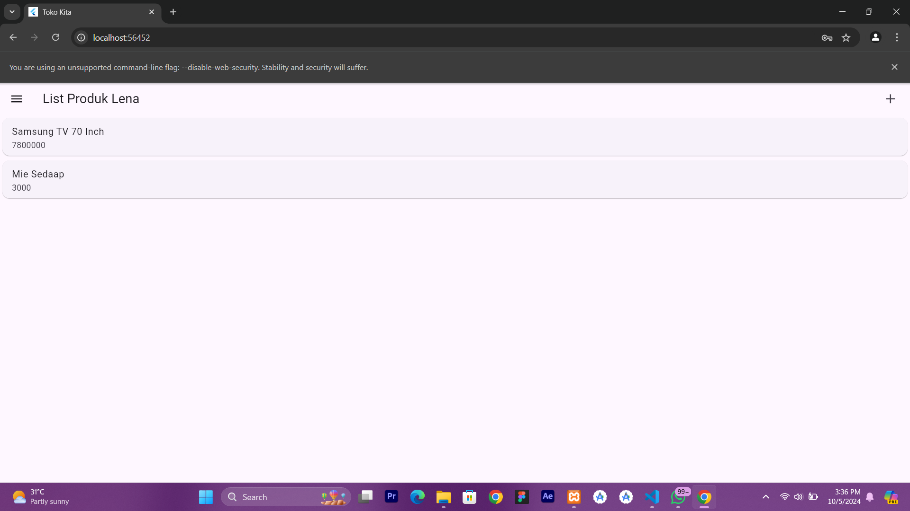
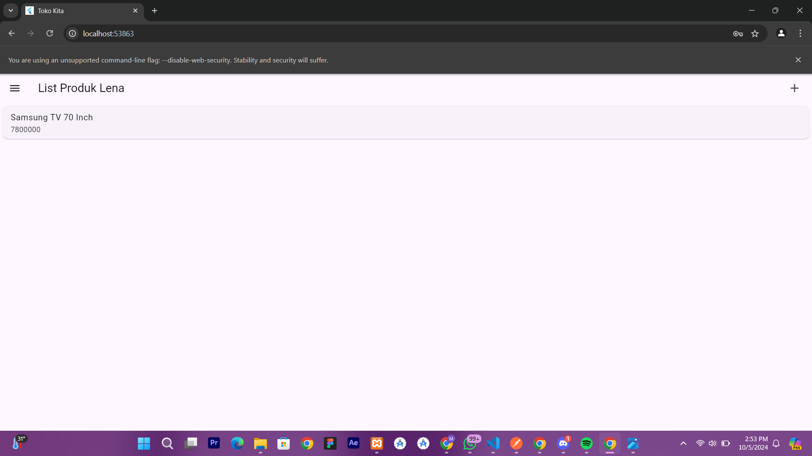
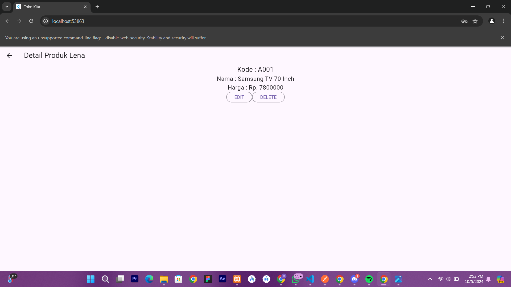
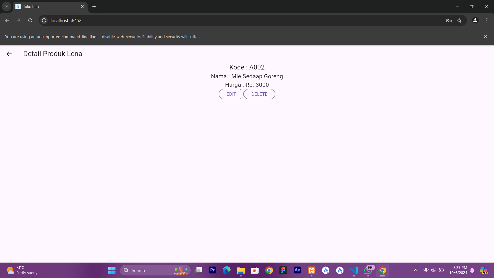
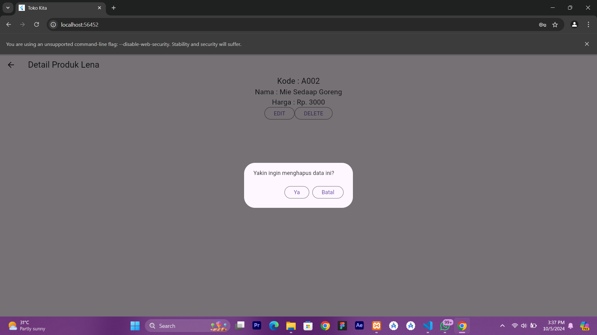
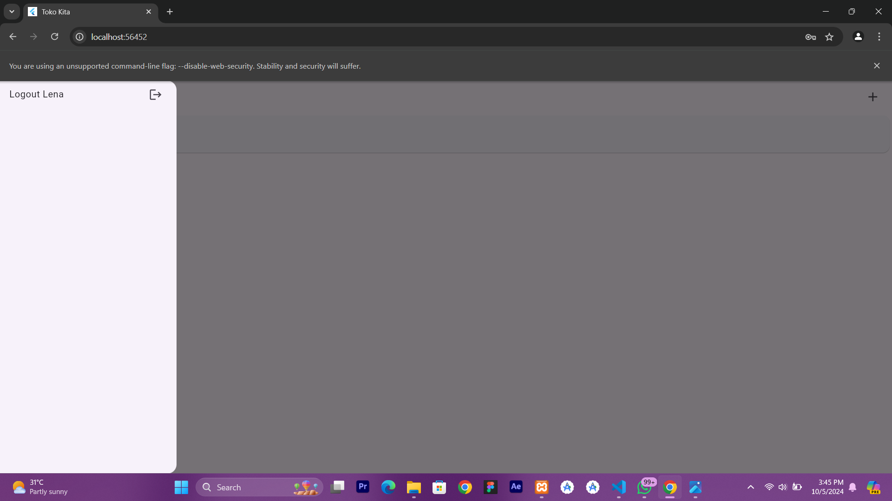

# tokokita
## Penjelasan
1. Proses Registrasi
   a. 
      Proses registrasi dimulai dengan menampilkan formulir yang berisi input untuk nama, email, password, dan konfirmasi password. Pengguna memasukkan nama (minimal 3 karakter), email dengan validasi format yang benar, password (minimal 6 karakter), dan mengkonfirmasi password yang dimasukkan sebelumnya. Setelah semua data terisi, pengguna menekan tombol registrasi yang akan memvalidasi form. Jika semua input valid, fungsi `_submit()` akan dipanggil untuk mengumpulkan data dari formulir dan mengirimkannya ke `RegistrasiBloc`. Jika registrasi berhasil, dialog sukses akan ditampilkan; jika gagal, dialog peringatan akan muncul. Di sisi backend, data dikirim ke endpoint API untuk registrasi melalui metode POST. Kelas `Registrasi` digunakan untuk mengelola respons dari server, yang berisi kode, status, dan data. Metode `post()` dalam `api.dart` bertanggung jawab untuk melakukan HTTP POST ke server, menyelesaikan seluruh proses registrasi.
   Popup sukses ditampilkan di dalam fungsi _submit() pada registrasi_page.dart setelah registrasi berhasil. Dialog ini memberi tahu pengguna bahwa registrasi telah berhasil dan meminta mereka untuk login.
2. Proses Login
   a. 
     -Pengguna mengisi email dan password di formulir login.
     -Setelah menekan tombol "Login", data dikirim melalui fungsi _submit().
   Tidak ada popup khusus yang ditampilkan saat login berhasil, tetapi pengguna akan langsung diarahkan ke halaman produk.
   b. 
     Jika login gagal (kode bukan 200) atau terjadi error saat memproses permintaan, dialog peringatan ditampilkan.
     Dialog peringatan yang muncul memberikan pesan "Login gagal, silahkan coba lagi". Popup ini ditangani dengan menggunakan widget WarningDialog.
3. Proses Tambah Produk
   a. 
      - Pengguna mengisi formulir di ProdukForm untuk menambahkan produk baru.
      - Saat tombol "SIMPAN" ditekan, fungsi simpan() dipanggil.
      - Data produk diambil dari kontroler dan objek Produk baru dibuat.
      - Data kemudian dikirim menggunakan ProdukBloc.addProduk().
   b. 
      - Jika penyimpanan berhasil, pengguna diarahkan ke halaman ProdukPage.
      - Jika gagal, dialog peringatan ditampilkan dengan pesan: "Simpan gagal, silahkan coba lagi".
4. Proses Edit Produk
   a. 
     - Pengguna memilih produk dari daftar di ProdukPage.
     - Detail produk ditampilkan di ProdukDetail, termasuk kode, nama, dan harga produk.
     - Pengguna dapat mengedit atau menghapus produk dari halaman ini.
   b.  
    - Pengguna menekan tombol "EDIT" di halaman detail produk.
    - Halaman ProdukForm terbuka dengan data produk yang ada untuk diubah.
    - Setelah melakukan perubahan, pengguna menekan tombol "UBAH".
    - Fungsi ubah() dipanggil, dan data produk dikirim menggunakan ProdukBloc.updateProduk().
    - Jika pembaruan berhasil, pengguna diarahkan kembali ke ProdukPage.
    - Jika gagal, dialog peringatan ditampilkan dengan pesan: "Permintaan ubah data gagal, silahkan coba lagi".
5. Proses Delete Produk
   a.  
    - Pengguna menekan tombol "DELETE" di halaman detail produk.
    - Dialog konfirmasi muncul, menanyakan apakah pengguna yakin ingin menghapus produk.
    - Jika pengguna memilih "Ya", produk dihapus dengan memanggil ProdukBloc.deleteProduk().
    - Jika penghapusan berhasil, pengguna diarahkan kembali ke ProdukPage.
    - Jika gagal, dialog peringatan ditampilkan dengan pesan: "Hapus gagal, silahkan coba lagi".
6. Proses Logout
   a.  
       Proses logout dimulai ketika pengguna menekan opsi "Logout Lena" di dalam drawer pada `ProdukPage`, yang kemudian memanggil fungsi `LogoutBloc.logout()` untuk menghapus informasi pengguna. Setelah logout berhasil, pengguna diarahkan kembali ke `LoginPage` menggunakan `Navigator.of(context).pushAndRemoveUntil()` untuk memastikan semua rute sebelumnya dihapus. Proses ini berjalan tanpa menampilkan dialog atau popup, namun dapat ditambahkan jika diperlukan untuk notifikasi atau konfirmasi.
